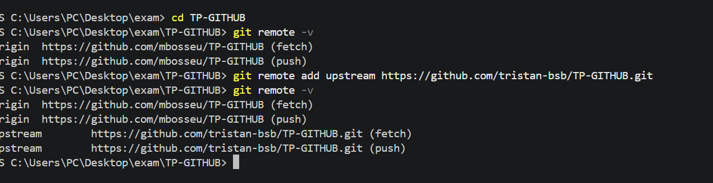
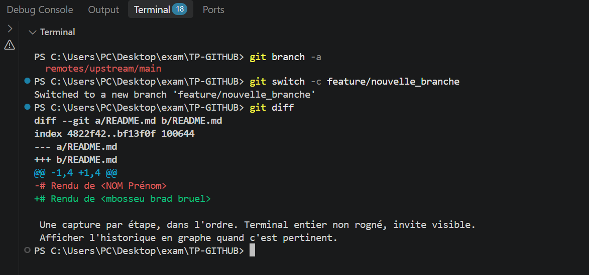
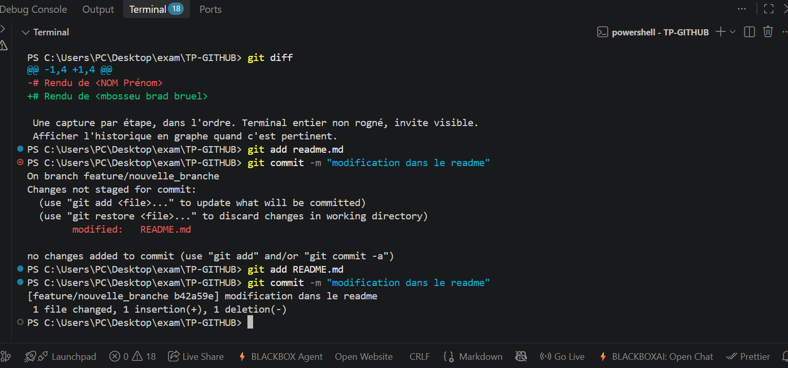
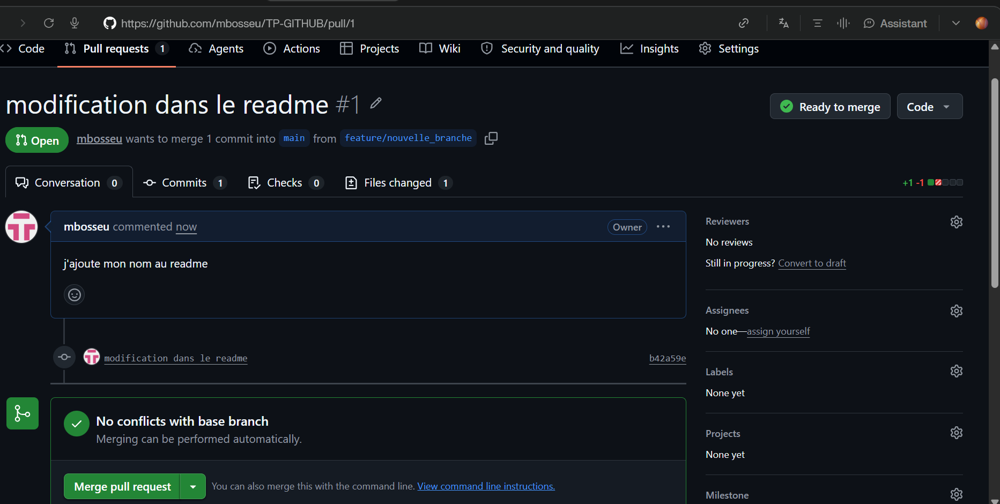
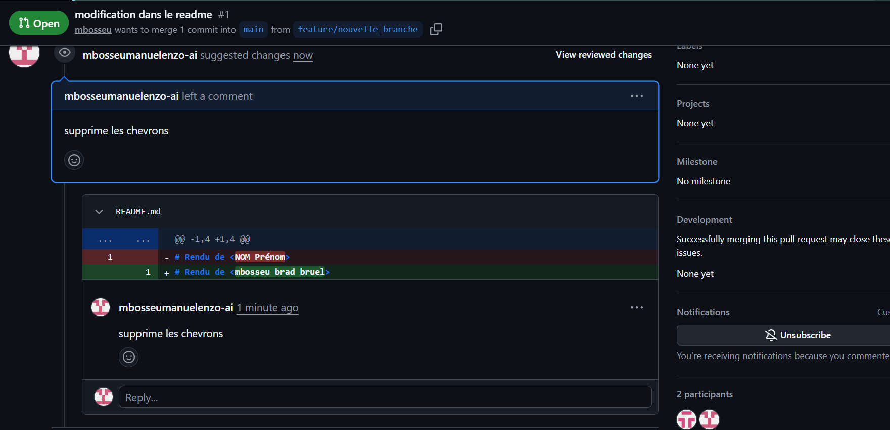

# Rendu de mbosseu brad bruel

Une capture par étape, dans l'ordre. Terminal entier non rogné, invite visible.
Afficher l'historique en graphe quand c'est pertinent.

## Niveau 1
1. Configuration Git

2. Branche de travail

3. Historique des commits

4. Pull Request

5. Revue croisée

## Niveau 2
6. Secret retiré du suivi

7. Conflit résolu (marqueurs avant, graphe après)

8. Revert du bandeau promo

9. Issue fermée par une Pull Request

10. Protection de main et CI au vert

## Cible mobile
11. Commit distant récupéré et conflit résolu
(capture)

## Trois commits annotés
1. <hash> :
2. <hash> :
3. <hash> :
